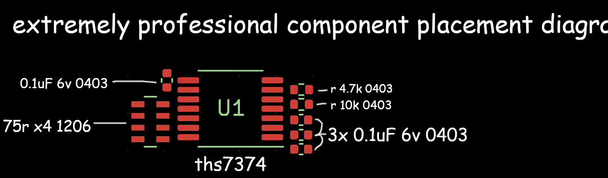

# Where Shit Goes

If you really want to assemble this:

## Known issues

* The 0.1uF 0403 capacitor really pushes the jank factor of this design into the stratosphere. I have no idea
  how long this will hold up long term.
* I haven't tested the CSYNC output because the SCART cable I use is sync-on-composite. It is identical to Tsorri Mahm's
  implementation, so it *should* work. (Doesn't mean it will.)