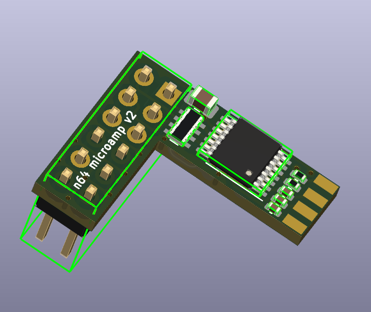

# n64 microamp v2

First production-ready version, if you want to call it that. Cost per unit is easily below $5 a piece even after factoring in labor, shipping and customs charges.

## Changes from v1

- Smoothing cap is now a 10uF 0802
- Jumper on bottom side of PCB can be cut to prevent the amp from driving CSYNC if necessary

## Known issues

- I'm still waiting on the PCBs, but this is a design that I'm confident should work.
- I still haven't tested the CSYNC output as I only have a sync-on-luma SCART cable.