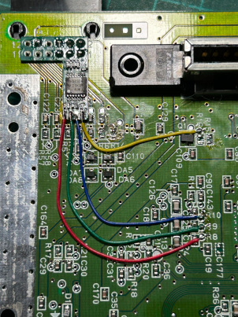
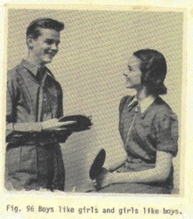

# n64-microamp: Extremely cheap and janky Nintendo 64 RGB amp mod

Another exercise in extreme cost-downing. This time, it's an attempt to make the most minimalist yet still functional Nintendo 64 RGB amp.
This is accomplished in only eight tiny annoying-to-solder parts.

Circuit is entirely analog so you only get the Gerbers.

## WARNING: STILL UNDER CONSTRUCTION

While v1 works, it hasn't been thoroughly tested yet, and is known to have problems that will be corrected for v2.

## Schematic

Virtually the same as [Tzorri Mahm's board](https://github.com/TzorriMahm/N64_RGB_Amp), but with the following differences:

- The 47pF caps on the output lines have been removed. The THS7374 datasheet says these are there to prevent "ringing" interference,
  but they are not necessary for proper functionality.
- No ferrite bead on the power supply line.
- No power stabilization caps except for the one required by the THS7374.
- No lowpass filter enable pad. Sorry to all five people who use that feature.
- 0603 components have been changed to smaller and cheaper 0403s where safe to do so.
- 75 ohm current limiting resistors on the RGB outputs are now grouped together into a single 1206 resistor array.
- As a result of a lot of things being left off the board, the board has a somewhat smaller footprint, but is slightly longer.

## Installation

See readmes in Gerber directories for BoM and component placement information.

The four solderpoints at the end of the board are, in this order: R, G, B, CSYNC.

**On NUS-CPU-01 through NUS-CPU-03 boards**, the CSYNC pin on the multi-out will be driven by the N64. If you'd prefer to have the
amp board drive it, you need to remove these components: R1 R14 R15 R16 C22. If those components are not populated, then the
board has no CSYNC and you will need to install the CSYNC wire.

**On NUS-CPU-04 boards**, the components that normally drive CSYNC will not be on the board.

For the aforementioned boards, installation requires three or four wires:
- R -> R8
- G -> R9
- B -> R10
- If CSYNC needed, CSYNC -> R16

**NUS-CPU-05 through NUS-CPU-09 boards need a separate DAC to work with this mod.** Nintendo integrated NTSC video encoding onto a
single chip (AVDC-NUS and MAV-NUS) so there are no more analog RGB outputs. You will either need to use an external DAC or try
a different mod (Tim Worthington's N64RGB or similar) to get RGB out of those systems.

**And don't forget to put some kapton tape (or other insulator) under the board before you solder it in!**

## Bugs

v1-specific:
- The power stabilization capacitor is a 0403 at 0.1uF, which will probably not hold up long term. This will be changed to a 0603 10uF on v2.
- The THS7374 gets uncomfortably hot during operation. I'm not sure if this is normal or not, but will investigate the cause.

## License

Public domain